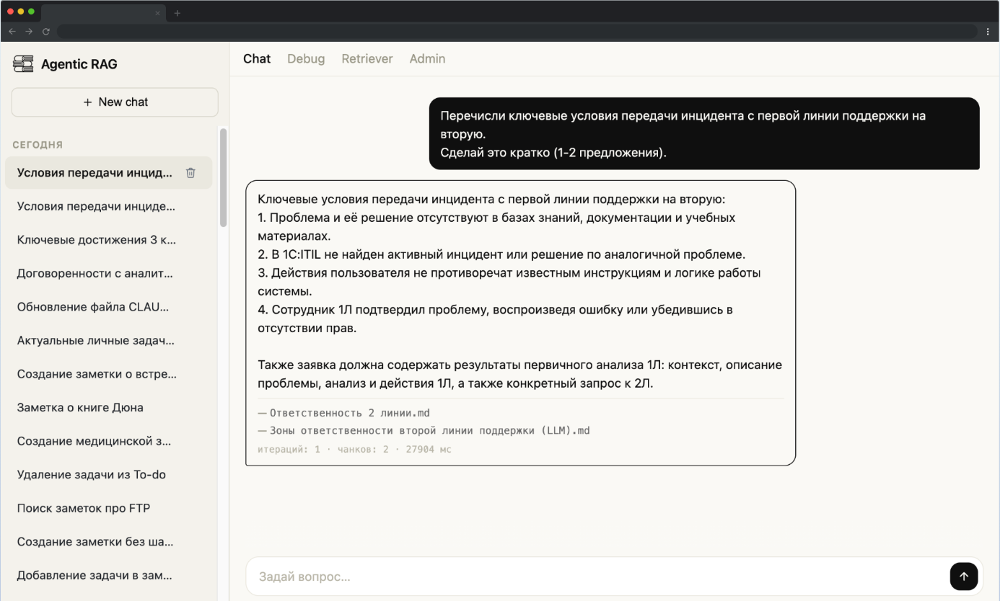
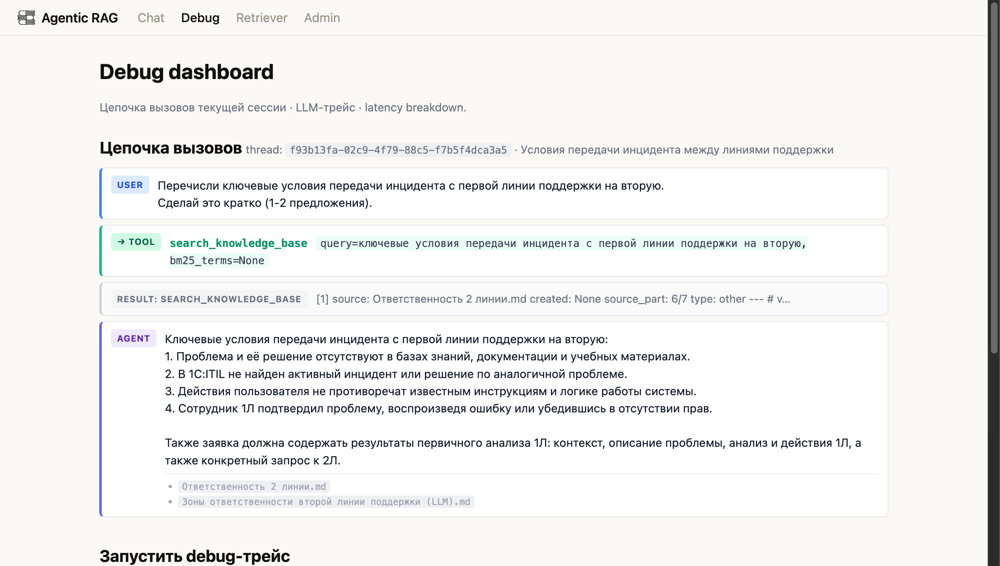

# RAGv2 — Агентный персональный ИИ-помощник по базе знаний Obsidian


**RAGv2** — production-готовый агентный RAG-ассистент поверх личного хранилища Obsidian. Работает на CPU-only железе (домашний сервер, без GPU). Отвечает на вопросы по персональной базе знаний с указанием источников; умеет планировать многошаговые запросы через LangGraph ReAct-агент.

---

## Ключевые возможности

| Возможность            | Реализация                                                  |
| ---------------------- | ----------------------------------------------------------- |
| Агентная архитектура   | Async LangGraph ReAct, до 5 итераций, guardrail против петли |
| MCP-интеграция         | Встроенный mcp-obsidian (stdio), 7 инструментов CRUD заметок |
| Async-граф             | AsyncSqliteSaver + `ainvoke`, persistent MCP-session через AsyncExitStack |
| Гибридный поиск        | Dense (E5-large multilingual) + BM25 + RRF fusion           |
| Parent-Child чанкинг   | Поиск по малым chunks, LLM получает крупный контекст        |
| Кросс-энкодер          | jinaai/jina-reranker-v2-base-multilingual (ONNX, CPU)       |
| RAGAS evaluation       | 18 golden Q&A, 4 метрики + LLM-судья (шкала 0–3)            |
| Веб-интерфейс + PWA    | FastAPI + Jinja2, устанавливается на телефон как приложение |
| Персистентная история  | SQLite (AsyncSqliteSaver), хранение 60 дней                 |
| Контекстное обогащение | Метаданные (файл, тип, теги, дата) инжектируются в чанк     |
| CI/CD                  | GitHub Actions (ruff + pytest) → make deploy → Docker       |
| 13 ADR                 | Все архитектурные решения задокументированы                 |

---

## Архитектура

```
┌─────────────────────────────────────────────────────────┐
│                    Пользователь                         │
│              Browser / PWA / Telegram Bot               │
└────────────────────────┬────────────────────────────────┘
                         │ HTTP
┌────────────────────────▼────────────────────────────────┐
│               FastAPI Web (interfaces/)                 │
│       /chat  /search  /sessions  /admin  /debug         │
└────────────────────────┬────────────────────────────────┘
                         │
┌────────────────────────▼────────────────────────────────┐
│           Async LangGraph Agent (agent/)                │
│                                                         │
│  START → [agent] → [tools] → [agent] → [generate] → END │
│                  ↑                   ↓                  │
│           tool_calls           max 5 итераций           │
│                                                         │
│  Built-in tools:                                        │
│    search_knowledge_base | get_current_date |           │
│    create_hub_note                                      │
│                                                         │
│  MCP-Obsidian tools (через langchain-mcp-adapters):     │
│    list_vault | find_note | read_note |                 │
│    create_note | update_note | append_to_note |         │
│    get_templates                                        │
└────┬──────────────────────────────────────┬─────────────┘
     │ search()                             │ stdio (JSON-RPC)
     │                          ┌───────────▼─────────────┐
     │                          │  MCP Server (subprocess)│
     │                          │  mcp_obsidian/server.py │
     │                          │  → Obsidian Vault (FS)  │
     │                          └─────────────────────────┘
┌────▼────────────────────────────────────────────────────┐
│            Retriever — гибридный поиск                  │
│                                                         │
│  ┌─────────┐                                            │
│  │ E5-large│ ──dense──┐                                 │
│  └─────────┘          ├── RRF fusion → cross-encoder    │
│  ┌──────┐             │                                 │
│  │ BM25 │ ──sparse────┘                                 │
│  └──────┘                                               │
│  Child chunks (800 токенов) → агрегация → Parent (2000) │
└────────┬────────────────────────────────────────────────┘
         │
┌────────▼────────────────────────────────────────────────┐
│                  Qdrant (Docker)                        │
│     collection: obsidian                                │
│     payload index: parent_id, file_path, chunk_type     │
│     vectors: dense (768-dim) + sparse (BM25)            │
└─────────────────────────────────────────────────────────┘

┌─────────────────────────────────────────────────────────┐
│             SQLite  (data/agent.sqlite)                 │
│   AsyncSqliteSaver (aiosqlite) + метаданные сессий      │
└─────────────────────────────────────────────────────────┘
```

**Docker Compose — 3 сервиса:**
- `qdrant` — векторная БД (Qdrant v1.17), данные хранятся в Docker volume
- `app` — FastAPI-приложение + LangGraph агент + APScheduler
- `webdav` — WebDAV-сервер для синхронизации Obsidian vault (плагин Remotely Save)

---

## MCP-интеграция

Агент модифицирует базу знаний через **Model Context Protocol**. MCP-тулзы выглядят для агента как обычные LangChain `BaseTool` — он не знает, что они исполняются во внешнем процессе.

**7 MCP-инструментов для работы с Obsidian:**

| Tool             | Описание                                                              |
| ---------------- | --------------------------------------------------------------------- |
| `list_vault`     | Дерево vault с настраиваемой глубиной                                 |
| `find_note`      | Поиск файла по имени (case-insensitive, рекурсивно)                   |
| `read_note`      | Чтение заметки целиком с разбором frontmatter                         |
| `create_note`    | Создание из шаблона (`template_name`) с автозаполнением frontmatter   |
| `update_note`    | Замена тела и/или merge frontmatter                                   |
| `append_to_note` | Дописать контент после указанного заголовка                           |
| `get_templates`  | Список шаблонов из `04. Шаблоны/` (рекурсивно) с превью и frontmatter |

Решение задокументировано в [ADR-0013](docs/knowledge%20base/adr/0013-mcp-obsidian-integration.md): почему stdio, а не WebDAV-MCP; почему persistent session; trade-off с async-графом.

---

## Tech Stack

| Компонент | Технология |
|---|---|
| Агент | LangGraph 0.4+ (ReAct pattern, async via `ainvoke`) |
| MCP | `langchain-mcp-adapters` 0.1+ + `mcp[cli]` 1.0+ (stdio transport) |
| LLM | OpenRouter → gpt-4.1-mini (OpenAI-совместимый API) |
| Embeddings | intfloat/multilingual-e5-large (CPU, 768-dim) |
| Sparse | Qdrant/bm25 (FastEmbed, ONNX) |
| Reranker | jinaai/jina-reranker-v2-base-multilingual (ONNX, CPU) |
| Vector DB | Qdrant 1.17 (Docker) |
| Веб | FastAPI 0.100+ + Uvicorn + Jinja2 |
| Конфиг | Pydantic v2 + config.yaml + .env |
| Persistence | SQLite (LangGraph AsyncSqliteSaver + `aiosqlite`) |
| Scheduler | APScheduler 3.x |
| Eval | RAGAS 0.4+ |
| CI/CD | GitHub Actions + pre-commit (ruff) + Makefile + Docker |
| Runtime | Python 3.11, CPU-only |

---

## Скриншоты

### Чат-интерфейс



### Debug-дашборд (трейс агента, retrieval, latency)



---

## Конфигурация

Все параметры — в `config.yaml`. Секреты — в `.env` (не попадает в git).

Ключевые параметры поиска (подобраны по RAGAS-метрикам):

```yaml
search:
  max_chunks: 15
  fetch_k: 15
  dense_score_threshold: 0.84   # cosine similarity
  sparse_score_threshold: 1.35  # BM25 score
  use_reranking: false          # кросс-энкодер, включить при желании

ingest:
  chunk_size: 800               # child-чанк (используется при поиске)
  parent_chunk_size: 2000       # parent-чанк (передаётся в LLM)
  parent_chunk_overlap: 200
  enrich_content: true          # метаданные инжектируются в текст чанка

mcp:
  enabled: true                 # подключать MCP-тулзы при старте агента
  excluded_tools: []            # имена MCP-тулзов, которые скрыть от агента
  init_timeout_sec: 15.0        # таймаут на старт stdio-subprocess
```

---

## Оценка качества (RAGAS)

Проект содержит 18 golden Q&A кейсов (fact / concept / procedure / negative) и полный eval-pipeline.

### Метрики (апрель 2026)

| Метрика | Значение |
|---|---|
| Faithfulness | 0.85 |
| Answer Relevancy | 0.78 |
| Context Precision | 0.75 |
| Context Recall | 0.81 |
| LLM-судья (0–3) | 2.4 |

### Запустить eval

```bash
pip install ".[eval]"

python -m eval.eval_ragas                  # все 18 кейсов через retriever
python -m eval.eval_ragas --samples 3      # быстрый прогон
python -m eval.eval_ragas --mode agent     # прогон через агента
python -m eval.compare_splitters           # сравнение 5 стратегий чанкинга
```

Отчёты сохраняются в `reports/` в Markdown.

---

## Структура проекта

```
ragv2/
├── agent/              # LangGraph агент (async)
│   ├── graph.py        # сборка графа, ask() через ainvoke(), AsyncSqliteSaver
│   ├── nodes.py        # ноды: agent, tools, generate
│   ├── tools.py        # @tool: search_knowledge_base, get_current_date, create_hub_note
│   ├── mcp_tools.py    # MultiServerMCPClient + persistent session (AsyncExitStack)
│   ├── state.py        # AgentState (TypedDict + LangGraph annotations)
│   ├── prompts.py      # system prompt, title prompt
│   └── sessions.py     # метаданные сессий (SQLite)
│
├── mcp_obsidian/       # встроенный MCP-сервер (stdio)
│   └── server.py       # 7 tools: list_vault, find_note, read/create/update/append_note, get_templates
│
├── retriever/          # индексация и поиск
│   ├── indexer.py      # инкрементальная индексация в Qdrant
│   ├── search.py       # гибридный поиск (dense + BM25 + RRF)
│   ├── chunker.py      # Parent-Child чанкинг (MHTS + RCTS)
│   └── embeddings.py   # синглтон E5-large
│
├── eval/               # оценка качества
│   ├── golden_set.yaml # 18 Q&A кейсов
│   ├── eval_ragas.py   # CLI: запуск RAGAS
│   ├── metrics.py      # RAGAS метрики
│   └── judge.py        # LLM-судья (0–3)
│
├── interfaces/         # точки входа
│   ├── cli.py          # uvicorn entrypoint
│   └── web/
│       ├── app.py      # FastAPI factory
│       ├── routers/    # chat, search, sessions, admin, pages
│       └── templates/  # Jinja2: chat, debug, admin
│
├── core/               # общий код
│   ├── config.py       # Pydantic AppConfig (yaml + env)
│   ├── llm_client.py   # get_llm() синглтон
│   └── types.py        # SearchResult, AgentResponse
│
├── docs/knowledge base/
│   ├── adr/            # 12 Architecture Decision Records
│   └── plan/           # планирование по фазам (Phase 0–4)
│
├── docker-compose.yml
├── Dockerfile
├── Makefile            # lint, test, deploy, logs
└── pyproject.toml
```

---

## Архитектурные решения (ADR)

| ADR | Решение |
|---|---|
| 0001 | Общая архитектура: LangGraph ReAct vs. чистый Python |
| 0002 | Инфраструктура: Qdrant Docker + WebDAV sync |
| 0003 | BM25: агент извлекает жёсткие термины для sparse-поиска |
| 0004 | Контекстное обогащение чанков метаданными |
| 0005 | Граф агента: 3-нодовая структура |
| 0006 | Eval-модуль: RAGAS + LLM-судья (0–3) |
| 0007 | Оптимизация retrieval: сравнение 5 стратегий |
| 0008 | Session persistence: SQLite SqliteSaver |
| 0009 | Web UI: FastAPI + Jinja2 SSR vs. SPA |
| 0010 | Parent-Child чанкинг |
| 0011 | PWA-поддержка |
| 0012 | CI/CD: 4-слойный pipeline |
| 0013 | MCP-интеграция: stdio vs HTTP, persistent session, async-граф |

Все ADR в [`docs/knowledge base/adr/`](docs/knowledge%20base/adr/).

---

## Команды разработчика

```bash
make lint      # ruff check .
make test      # pytest -x -q
make check     # lint + test
make deploy    # git pull + docker compose up -d --build на prod
make logs      # docker compose logs -f app
make status    # docker compose ps
make restart   # docker compose restart app
```

---

## Лицензия

MIT — см. [LICENSE](LICENSE).