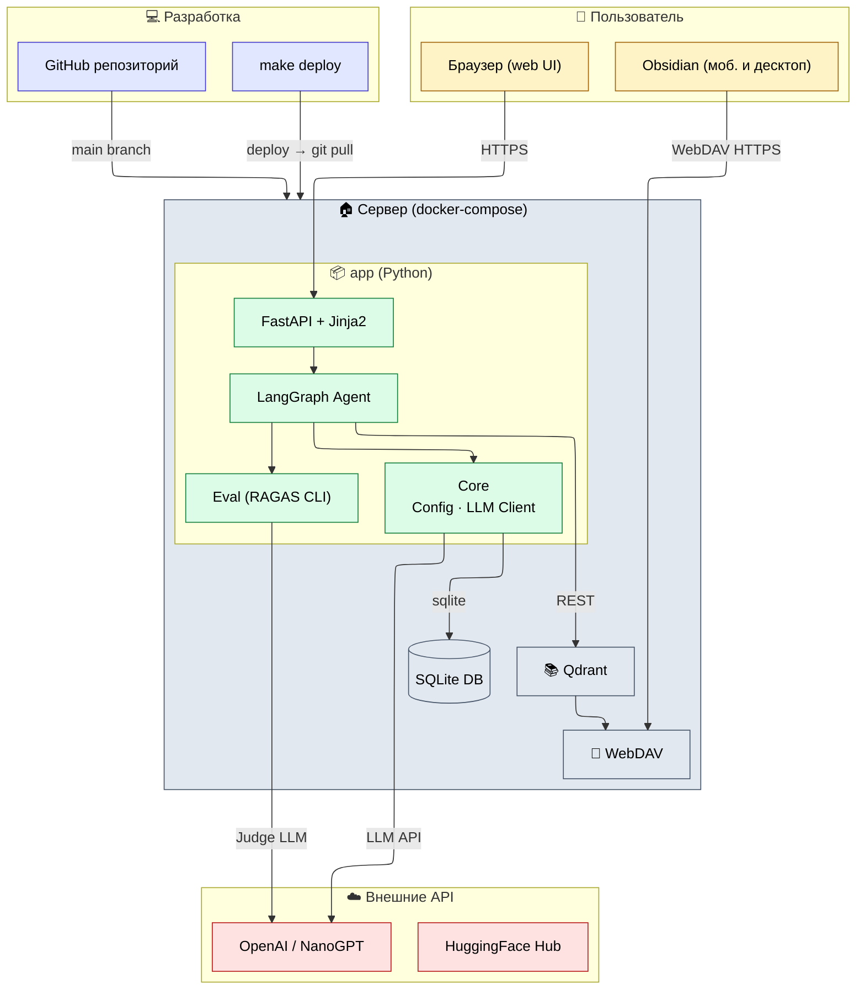

# Архитектурный обзор RAGv2 (упрощенный)

Упрощённая схема для быстрого ознакомления. Полная версия — [`architecture-overview.md`](architecture-overview.md).

```mermaid
%%{init: {"layout": "elk"}}%%
flowchart TB
    subgraph User["👤 Пользователь"]
        Browser["Браузер (web UI)"]
        Obsidian["Obsidian (моб. и десктоп)"]
    end

    subgraph Dev["💻 Разработка"]
        Repo["GitHub репозиторий"]
        Make["make deploy"]
    end

    subgraph Server["🏠 Сервер (docker‑compose)"]
        subgraph App["📦 app (Python)"]
            Web["FastAPI + Jinja2"]
            Agent["LangGraph Agent"]
            Core["Core<br/>Config · LLM Client"]
            Eval["Eval (RAGAS CLI)"]
        end

        Qdrant["📚 Qdrant"]
        WebDAV["💾 WebDAV"]
        SQLite[("SQLite DB")]
    end

    subgraph Ext["☁️ Внешние API"]
        OpenAI["OpenAI / NanoGPT"]
        HF["HuggingFace Hub"]
    end

    Browser -->|"HTTPS"| Web
    Obsidian -->|"WebDAV HTTPS"| WebDAV
    Web --> Agent
    Agent --> Core
    Core -->|"LLM API"| OpenAI
    Agent --> Eval
    Eval -->|"Judge LLM"| OpenAI
    Agent -->|"REST"| Qdrant
    Core -->|"sqlite"| SQLite
    Qdrant --> WebDAV
    Make -->|"deploy → git pull"| Server
    Repo -->|"main branch"| Server

    %% Цвета
    classDef user fill:#fef3c7,stroke:#a16207,color:#000
    classDef dev fill:#e0e7ff,stroke:#4338ca,color:#000
    classDef runtime fill:#dcfce7,stroke:#15803d,color:#000
    classDef infra fill:#e2e8f0,stroke:#475569,color:#000
    classDef external fill:#fee2e2,stroke:#b91c1c,color:#000

    class Browser,Obsidian user
    class Repo,Make dev
    class Web,Agent,Core,Eval runtime
    class Qdrant,WebDAV,SQLite,Server infra
    class OpenAI,HF external
```
