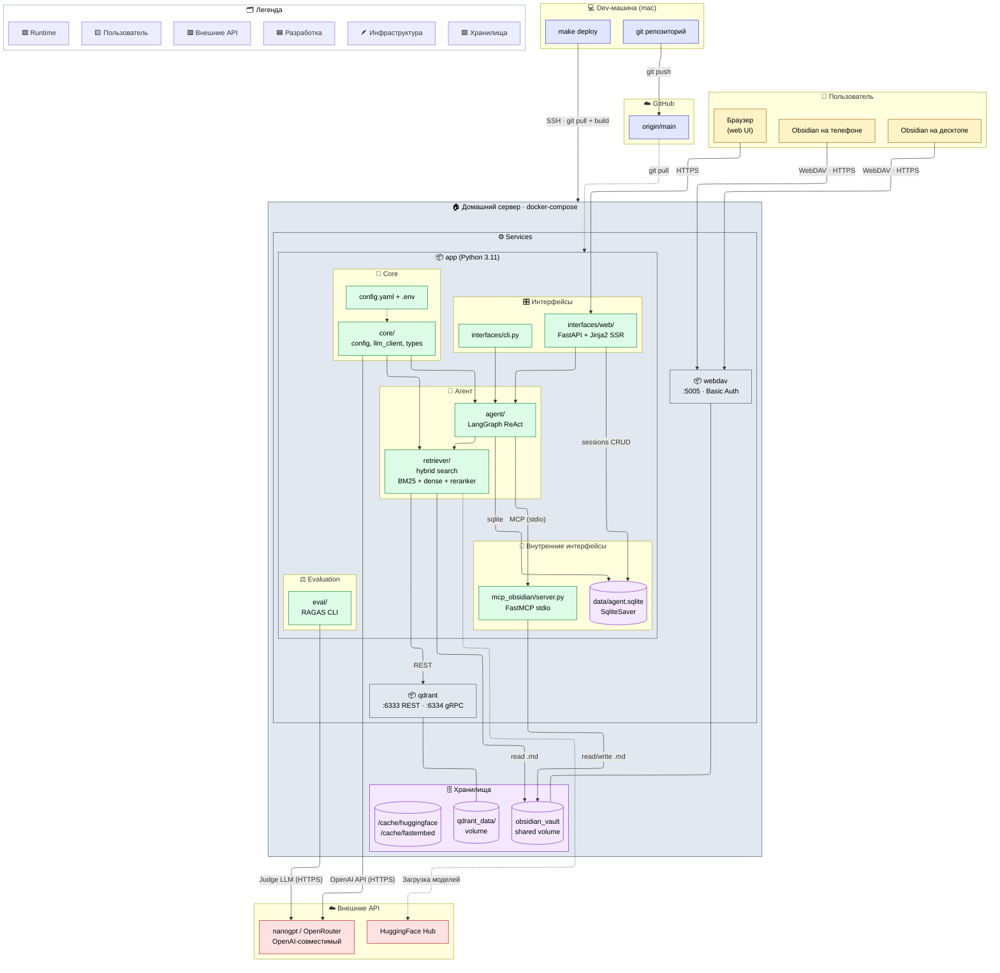

# Архитектурный обзор RAGv2

Одна схема уровня Context + Container: кто пользуется системой, какие процессы крутятся на домашнем сервере, какие внешние API подключены и как код туда попадает.

Поддерживай эту схему живой — см. раздел «Как обновлять» внизу.



## Легенда

- 🟡 **Жёлтое** — пользователь и его клиенты (браузер, Obsidian).
- 🟣 **Фиолетовое** — хранилища и volume'ы (SQLite, Qdrant data, vault, кеши HF).
- 🟢 **Зелёное** — код проекта (Python-модули внутри контейнера `app`).
- ⚪ **Серое** — инфраструктура (контейнеры, хост, compose).
- 🔵 **Синее** — dev-машина и GitHub (путь кода до прода).
- 🔴 **Красное** — внешние API (LLM-провайдер, HuggingFace).

## Ключевые особенности

- **MCP — subprocess, не HTTP**: `mcp_obsidian/server.py` запускается агентом как дочерний процесс через stdio (FastMCP). Сессия MCP должна быть создана в том же event-loop, в котором используется — иначе кросс-loop deadlock с uvicorn.
- **Один shared volume `obsidian_vault`** монтируется и в `app` (как `/vault`, rw — нужен retriever'у и MCP), и в `webdav` — поэтому правки с телефона через Remotely Save сразу видны индексатору и агенту.
- **Qdrant в Docker-режиме** (`http://qdrant:6333`), а не embedded. Embedded остался как fallback (надо вернуть `path` в `config.yaml`). Данные в volume `./qdrant_data`.
- **LLM только через nanogpt/OpenRouter**: ключ в `.env` (`NANO_GPT_API_KEY`), модель `openai/gpt-4.1-mini`. Локального LLM нет — CPU-сервер не тянет.
- **HuggingFace Hub дёргается только при первом запуске** (скачивание E5-large и jina-reranker в volume-кеш). Дальше — оффлайн. BM25-модель ищется в кеше через `_find_bm25_model_path()` чтобы обойти HF rate-limit.
- **Persistence — единая SQLite**: и LangGraph-чекпоинты (через `AsyncSqliteSaver` на `aiosqlite`), и метаданные сессий (через голый `sqlite3` в `agent/sessions.py`) живут в одном файле `data/agent.sqlite`. Cleanup ленивый, раз в час при `GET /api/sessions`.
- **Деплой — pull-модель**: `make deploy` ходит по SSH на `192.168.3.160`, делает `git pull` + `docker compose up -d --build`. CI/CD сборки на GitHub нет.
- **fastembed BM25 patch**: `py_rust_stemmers` сегфолтит на Python 3.14 → в site-packages подменён на обёртку `snowballstemmer`. При переустановке зависимостей патч надо накатывать заново. (На проде Python 3.11 — патч не нужен, актуален только локально.)
- **Telegram-бот пока не запущен** — задел есть (`TELEGRAM_BOT_TOKEN` в `.env`), но канала на схеме нет до фактического включения.

## Как обновлять

При любом изменении в составе системы — обновляй эту схему **в том же PR**, что и код. Это правило прописано и в `CLAUDE.md`.

Алгоритм:

1. Открой блок ```mermaid``` выше.
2. Добавь новый узел в подходящий `subgraph`:
   - канал пользователя → `User`
   - новый Python-модуль/контейнер в нашем коде → `App` или `Server`
   - внешний API → `Ext`
   - новый volume/БД → класс `storage`
3. Проведи стрелку с подписью протокола (`HTTPS Bearer`, `stdio`, `HTTP REST`, `WebDAV`, `gRPC`, …). Сплошная стрелка — синхронный hot-path, пунктир (`-.->`) — редкий/одноразовый/опциональный путь.
4. Назначь классу через `class NewNode className` (см. блок `classDef` внизу диаграммы).
5. Если интеграция нетривиальная (обход блокировок, fallback, кеш, рейт-лимит) — добавь одну строку в **«Ключевые особенности»**.
6. Если схема стала шире 6–7 subgraph'ов — пора выносить часть в отдельную диаграмму и оставлять здесь только верхний уровень. Спроси меня перед таким разделением.
